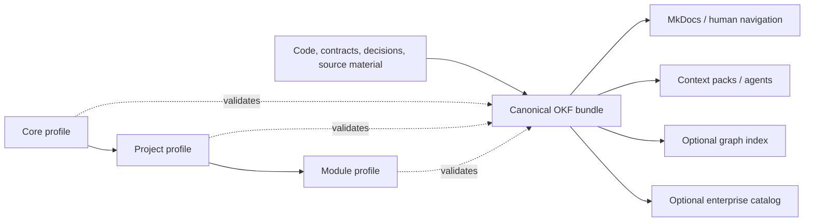

# Gnostoa

This site is a derived human-facing navigation projection. Canonical reusable
guidance lives in [`guidance/`](../guidance/index.md), while toolkit-only
self-knowledge lives in [`knowledge/`](../knowledge/index.md).

The kit defines a small canonical knowledge layer and a strict extension model
to reduce repeated repository exploration, contradictory documentation and
oversized agent prompts without introducing a mandatory knowledge service.

The dependency direction is one-way: module rules can depend on project rules,
and project rules can depend on core rules. The core must never depend on a
particular project, organization or implementation stack.

Operational entry points:

- [`guidance/index.md`](../guidance/index.md) routes reusable project workflows.
- [`knowledge/index.md`](../knowledge/index.md) routes toolkit-only
  self-knowledge.
- [`policy/guardrails.yaml`](../policy/guardrails.yaml) maps normative rules to
  ownership and enforcement.
- `core/continuous-integration.yaml` defines provider-neutral authoritative CI
  and advisory local feedback.
