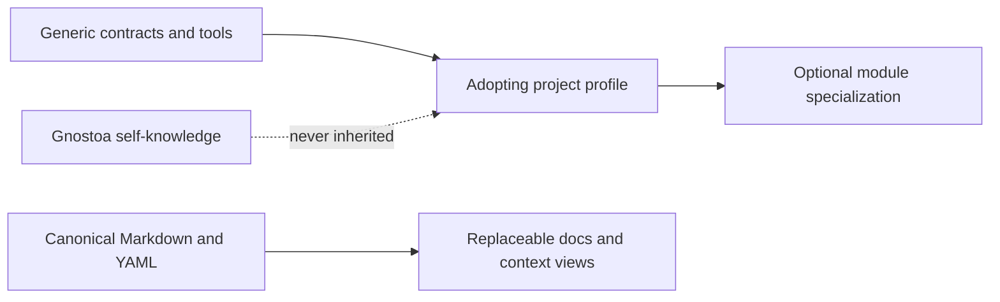

# Gnostoa

This site is a derived human-facing navigation projection. Canonical contracts,
guidance and project evidence remain in their owning repository surfaces.

Gnostoa validates Git-native project knowledge for people and software agents.
It combines structured Markdown, non-weakening profiles, deterministic checks
and bounded context views without requiring a hosted knowledge service.

> **Pre-stable:** `v0.1.1` is published as an immutable source release and one
> digest-pinned `linux/amd64` OCI image. No Python package, documentation site
> or production-ready service has been released. Read [Current status](status.md)
> for the exact identity and claim limits.

## Evaluate in five minutes

The [source quick start](quick-start.md) validates an anonymous bundle and
builds a bounded context pack. It provides both native and container routes and
states what the result does—and does not—prove.

## Find the right depth

| Goal | Start here |
|---|---|
| See whether the tool runs | [Five-minute quick start](quick-start.md) |
| Understand the model | [Architecture and layer contract](core/architecture.md) |
| Introduce it to a project | [Adoption guide](core/adoption.md) |
| Perform one project task | [Reusable guidance router](../guidance/index.md) |
| Inspect current maturity | [Current project status](status.md) |
| See delivery priorities | [Now / Next / Research roadmap](roadmap.md) |
| Audit the bootstrap evidence | [Self-dogfood assessment](../knowledge/assessments/gnostoa-self-dogfood-bootstrap-assessment.md) |
| Inspect publication exposure | [Provider audit snapshot](../knowledge/assessments/first-publication-provider-audit.md) |
| Inspect source-name risk | [Owner-confirmed screening](../knowledge/assessments/gnostoa-source-name-screening.md) |

## Three boundaries

- `core/`, `schemas/`, `tools/`, `ci/` and `templates/` form the generic public
  contract and its executable support.
- `guidance/` contains reusable, task-routed operating knowledge.
- `knowledge/` and `policy/` describe and govern Gnostoa itself; consumers do
  not inherit them.

The navigation deliberately foregrounds evaluation, adoption and public
contracts. Detailed guidance and project evidence remain linkable and
searchable without becoming the first-reader path.
