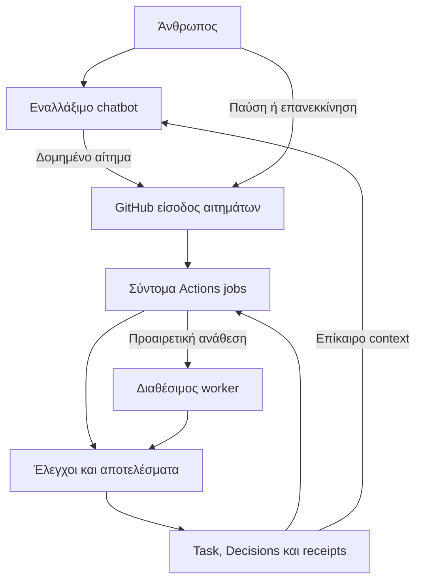

# Chatbot-first serverless operating-platform assessment

## Recording cut and interpretation

This draft Source records the full Greek research delivered on 2026-09-17,
followed by no silent edits to its historical observations. The owner separately
admitted its preservation and workflow linkage in Work Item #276. This recording
selects no new runtime, public contract, reviewer qualification or execution
authority. The Greek text is retained as research evidence; the English synopsis
and consumption map make its operational implications available to later agents.

**A newer provider observation supersedes the original report's current-work
claim:** at the recording read-back on 2026-09-17, protected main was still
`e071ab60a418eddda5bf008004ee96faafbf1e7c`, while the sole open `roadmap:now`
selection was [#275](https://github.com/ktogias/gnostoa/issues/275). That admitted
security slice preempts #262 for integration order. PR #272 remains a separate
candidate. The original report's observation of #262 is an earlier historical
cut, not the current selection at recording. Fresh provider read-back, not this
static document, determines current and successor work.

After the current security disposition, rebind the remaining #262 obligation
and Ariadne v9 to current provider state. Preserve the existing ascent: L0-lite,
useful L1, independently required Q0 and L2, then L3 and the measured leverage
gate; default return to #259 pre-Phase-D distillation, optional tiny #266-P0 and
fresh minimum Phase-D entrance/#183. Optional L4 stays inside the leverage gate
and returns to that route. This research adds no rung, universal prerequisite,
new v10 ordering or change to frozen Phase-D semantics.

## Operational synopsis

The missing piece is a demonstrated end-to-end operating loop that composes
existing contracts. The chatbot remains the primary conversational interface and
semantic coordinator. Git/provider records retain authoritative task, Decision
and effect evidence; short provider jobs perform admitted deterministic work;
qualified semantic contributors and optional coding workers supply the abilities
that cannot be derived mechanically.

Four roles must be qualified separately: plain chat with human relay, connected
conversational interface, coding executor and qualified reviewer. A connected
interface minimally needs fresh bounded context, authenticated bounded request
submission and receipt/status retrieval across sessions. Local shell, Docker,
Git push and a persistent chat session are not minimum interface requirements.
Plain chat can provide useful free operation through explicit human transfer;
it cannot cause an authenticated provider effect alone and does not satisfy #15's
goal of eliminating repeated mechanical transfer/polling.

At the inspected source, context packs are primarily bounded indexes, the task
envelope consumes caller observations, and R2A evaluates retained evidence.
Their existence does not demonstrate a full provider collector, live convergence,
effect-fenced dispatcher or populated Q0 qualification registry. Product/plan
documentation is time-bound evidence, not an account-level capability probe.

## Consumption map for the existing workflow

These are planning inputs for the next applicable owner-admitted slice. They do
not modify normative admission or acceptance gates through a research document.

| Existing owner / point of consumption | Research input to consume | Candidate-specific observation to obtain |
|---|---|---|
| #15 L0-lite and #14 orientation | Name the real task, source/intent/authority boundaries, durable task source and minimal loop before adding abstractions. | A fresh session can identify the exact selected subject and next permitted step without replaying the raw ledger. |
| #15 L1, #14 projection, #9 context admission | Build one useful live context packet with an explicit manifest; collect relevant issue comments, PR reviews and inline threads as distinct paginated channels before bounded selection. | Missing pages, stale observations or omitted blockers remain explicit; a packet does not claim completeness beyond its declared source set. |
| #15 L2, with #5 recovery | Authenticated intake, accepted request bytes, exact source and intent generation, effect-specific authority, fenced publication, receipts and read-before-retry. | Duplicate request, timeout after an actual write, same-SHA new intent, concurrent supersession and late output cannot silently authorize a new effect. Candidate bytes survive session loss. |
| #10 Q0, independently of L2 | Qualify interface, executor and reviewer separately by actual account/client/connector/route; record observation time, scope, identity, current availability and untested limits. | Read-only and tool-free routes cannot masquerade as writers; transport/schema success does not establish semantic competence or independence. |
| #15 L3 with #11/R2A | Use a real available semantic reconciler under existing assurance obligations; deterministic collection and scheduling consume its result. | Unavailable qualified semantic capacity becomes an explicit wait; mechanical checks cannot resolve contested semantic findings by themselves. |
| #8 watches and #15 recovery | Durable waits with event wake-up and bounded reconciliation; state distinguishes requested cancellation, effective revocation and stopped execution. | A missed event, delayed schedule or closed WebUI does not lose registered work; notification/monitoring is never claimed without a registered route. |
| #264 provider characterization | Probe only semantics materially needed by the selected route: dispatch identity, token-trigger behavior, rerun generations, concurrency, conditional writes and cancellation races. | Claims bind to actual API/workflow/ref/credential behavior; concurrency groups and an operation ID alone are not a durable queue or an idempotency proof. |
| #201 and optional #15 L4 | Consider one hosted executor/transport only when measured residual work justifies it; separate service/API capacity from chat subscriptions. | Verify source access, output persistence, cost/quota, permissions and return path before use; no silent paid fallback or weakened quorum. |
| #259 measured leverage/distillation | Compare useful outcomes, active owner time, relay/polling, recovery effort, failure/false-block rate and total cost against current practice. | Retain negative and missing outcomes in the denominator; optional adapters must earn their added maintenance. |

Receipts and projections must remain outside the sealed candidate's byte domain
or be bound by its existing declared protocol; adding operational evidence must
not silently change the candidate or restart its review identity. Request intake
must preserve the accepted bytes of mutable comments with provider-observed actor
and source identity. A summary or digest cannot recover lost source bytes.

An enforced generation fence requires serialization of revocation and publication
at the credential-bearing write boundary. A worker or connector that retains a
bypass write credential defeats that claim. The selected adapter must state its
actual conditional-write and race guarantees; this report promises neither
general exactly-once execution nor rollback of completed external effects.

## Smallest useful future demonstration

Choose one small real source change under the existing selected owner. Demonstrate
context export, a proposal from a plain free chat, explicit human relay where
needed, durable receipt/source publication, provider validation and controlled PR
creation. Close the chat and resume from another client using the recorded state.
Record all manual work. Separately measure a connected route with no recurring
manual transfer before claiming #15's automation objective.

The report proposes a small 5–10-task measurement series and fault cases. That is
a suggested experiment size, not a new compulsory gate. Select only the cases
needed to falsify the admitted candidate: incomplete pagination, duplicate or
ambiguous write, stale head/intent, rerun authorization, late result, revoked
generation, lost wake-up, missing bytes and exhausted qualified capacity. A
provider-specific failure is evidence for that route, not proof that every client
or provider behaves identically.

## Reuse, provenance and limits

The prior-art checkpoint in #276 reuses the completed primary-source research and
existing Gnostoa records, rather than commission the same search again. Compose
the Git-native mechanisms and provider-native jobs first; a generic workflow
engine, permanent own host and mandatory paid worker have no demonstrated need
in this recording. The separate JEPA assessment (#273 / PR #274) is related
research, not a prerequisite or substitute for the operational loop.

The intended use is linked design analysis and paraphrase. No external code,
dependency, vendor document or model artifact is imported. Later copying,
distribution, dependency acquisition or service use requires a use-specific
license/terms, provenance, security and maintenance check. Free-tier quotas and
capabilities may change; the report's cited official documentation does not prove
availability in the owner's actual accounts. No connector, worker or API was
activated to qualify the proposed routes during this research.

The preserved original is **53,381 UTF-8 bytes**, with SHA-256
`4120c11b239afd11a27f6c22c4248359da70498642dd8541d3114ad93939e5f1`.
The text between the following markers is that full original byte sequence;
interpret any original present-tense/provider-selection statement using its
historical cut and the recording update above.

<!-- BEGIN RETAINED ORIGINAL ASSESSMENT -->
# Gnostoa: λειτουργική πλατφόρμα για εναλλάξιμα chatbots
Έρευνα και πρόταση — 17 Σεπτεμβρίου 2026

**Κεντρική εκτίμηση.** Το πλάνο μπορεί να υλοποιηθεί με το chatbot ως κύρια συνομιλιακή διεπαφή και semantic orchestrator, GitHub ως αρχικό provider εκτέλεσης/κατάστασης και χωρίς δικό μας μόνιμο server ή διαρκώς ανοικτό υπολογιστή. Το κρίσιμο υπόλοιπο είναι η σύνδεση των υπαρχόντων συμβολαίων σε ένα μικρό, ανακτήσιμο λειτουργικό κύκλο. Δεν αρκούν ούτε οι οδηγίες προς τους agents ούτε η εγκατάσταση περισσότερων reviewers.

Η βασική χρήσιμη λειτουργία μπορεί να μην απαιτεί paid AI subscription. Η αδιάλειπτη, πλήρως αυτόνομη συγγραφή και σημασιολογική κρίση δεν μπορεί να εγγυηθεί μηδενικό κόστος ή μόνιμη διαθεσιμότητα: κάποιος διαθέσιμος άνθρωπος ή κατάλληλος AI executor πρέπει να παρέχει αυτές τις ικανότητες. Η αρχιτεκτονική οφείλει να συνεχίζει τις ανεξάρτητες μηχανικές εργασίες και να διατηρεί με ακρίβεια ό,τι περιμένει.

**Εμβέλεια και τεκμηρίωση.** Έγινε ανάγνωση του προστατευμένου main, του roadmap και των σχετικών source contracts, των live Issues #3, #5, #8, #10, #11, #14, #15, #259, #273 και των σχετικών #136, #201, #211, #264. Εξετάστηκαν οι νεότερες καταγραφές της Ariadne v9 και επίσημες πηγές υπηρεσιών. Το source inspection συνδέεται με το [main e071ab60a418eddda5bf008004ee96faafbf1e7c](https://github.com/ktogias/gnostoa/commit/e071ab60a418eddda5bf008004ee96faafbf1e7c), tree `46df4deb2b73579cfd4e8d43678ed0024722fe0e`. Στο provider read-back το μοναδικό ανοικτό `roadmap:now` ήταν το [#262](https://github.com/ktogias/gnostoa/issues/262), για συνέπεια Ruff scope και CI coverage. Η τελευταία ενσωμάτωση #271 αφορά αποφυγή διαρροής προστατευμένων review payloads στα CI logs· δεν παρέχει το λειτουργικό loop που εξετάζεται εδώ.

Η παρούσα είναι τεκμηριωμένη πρόταση. Δεν αποτελεί δοκιμασμένη νέα πλατφόρμα, αλλαγή roadmap, έναρξη worker, ενεργοποίηση connector ή account-level επιβεβαίωση quotas. Οι ενδεικτικές λειτουργίες/ονόματα παρακάτω δεν είναι ήδη διαθέσιμα public CLI commands.

**1. Τι έχουμε ήδη συμφωνήσει και τι υπάρχει**

Η [Ariadne v9](https://github.com/ktogias/gnostoa/issues/14#issuecomment-5706634917), το [αναλυτικό συμπλήρωμα](https://github.com/ktogias/gnostoa/issues/14#issuecomment-5706705782) και το [L0–L5 blueprint](https://github.com/ktogias/gnostoa/issues/15#issuecomment-5706403186) περιγράφουν ήδη μεγάλο μέρος της σωστής κατεύθυνσης. Άρα η ανησυχία εντοπίζει κυρίως κενό λειτουργικής ολοκλήρωσης και αποδεδειγμένης χρησιμότητας.

| Περιοχή | Υπάρχουσα βάση | Τι μένει λειτουργικά |
|---|---|---|
| Κανόνες και γνώση | Markdown/YAML, profiles, validators, guards, Decisions | Να ενεργοποιούνται αυτόματα στη σωστή εργασία και διαδρομή |
| Bounded context | Context packs, task envelope, orientation evaluator/projector | Συλλογή live provider state, πλήρης ως προς το δηλωμένο scope, εύκολη κατανάλωση από chat |
| Resume | Semantic checkpoint, source identities, handoff | Ανάκτηση μη δημοσιευμένων bytes και αμφίβολων εξωτερικών effects |
| Verification | Containerized GitHub Actions, runtime και CI contracts | Ελεγχόμενη ανάθεση από client που δεν διαθέτει shell/Docker |
| Review assurance | R2A και προστατευμένη αλυσίδα evidence/consumer | Live συλλογή, qualification, bounded semantic reconciliation και convergence |
| Qualification | #10/Q0 καταγεγραμμένο | Πραγματικές επίκαιρες καταχωρίσεις και δοκιμές των απαιτούμενων ικανοτήτων |
| Συντονισμός | #15 L1/L2/L3 σχεδιασμένα | Ζωντανός reducer, effect admission, enforced fence, receipts και ανάκτηση |
| Προαιρετικοί workers | Έρευνα #10/#201, optional L4 | Ένας επιλεγμένος και μετρημένος adapter, εφόσον χρειαστεί |

Το README ορίζει ήδη το Gnostoa ως μικρό Git-native toolkit, χωρίς ισχυρισμό πλήρους workflow engine ή production readiness. Η [Decision 0016](https://github.com/ktogias/gnostoa/blob/e071ab60a418eddda5bf008004ee96faafbf1e7c/knowledge/decisions/0016-evolve-human-agent-workflow-through-bounded-self-hosted-slices.md) καταγράφει ρητά ότι envelope/projection βελτιώνουν την επανεκκίνηση, αλλά δεν επιβάλλουν από μόνα τους τη συμπεριφορά των agents.

Ο έλεγχος του κώδικα δίνει τρεις συγκεκριμένες διακρίσεις. Το [build_context_pack.py](https://github.com/ktogias/gnostoa/blob/e071ab60a418eddda5bf008004ee96faafbf1e7c/tools/build_context_pack.py) παράγει κυρίως ευρετήριο εννοιών/περιγραφών/σχέσεων και root index, όχι όλα τα source bodies ή GitHub comments. Το task envelope καταναλώνει παρατηρήσεις του caller, δεν ανακτά μόνο του το live provider state. Και το R2A αξιολογεί ήδη συλλεγμένο evidence: η ύπαρξή του δεν αποδεικνύει live review collector ή convergence controller. Το protected qualification snapshot παραμένει με κενές καταχωρίσεις, άρα το Q0 είναι ουσιαστικό υπόλοιπο.

Η [προηγούμενη μελέτη συνεργασίας](https://github.com/ktogias/gnostoa/issues/10#issuecomment-5626244123) προβλέπει ήδη manual import/export για web-only chatbots. Η συνεισφορά της παρούσας είναι να μετατρέψει τις ήδη καταγεγραμμένες διαδρομές σε συγκεκριμένα υποστηριζόμενα επίπεδα και κριτήρια λειτουργίας.

Η διαφορά έχει ήδη αποδειχθεί στο [#5](https://github.com/ktogias/gnostoa/issues/5#issuecomment-5530295842): το «ξέρω τι έκανα» δεν διασώζει αλλαγές που υπήρχαν μόνο στον χαμένο χώρο εργασίας. Υπάρχει επίσης [καταγεγραμμένο ambiguous write](https://github.com/ktogias/gnostoa/issues/5#issuecomment-5569955419), όπου η ανάγνωση πριν από retry απέτρεψε διπλή ενέργεια.

**2. Πού ακριβώς πρέπει να ζει η πλατφόρμα**

Το chatbot διατηρεί τον διάλογο, ερμηνεύει τον στόχο, προτείνει πλάνο/αλλαγές και συνθέτει επιχειρήματα. Η εκτέλεση των ήδη εξουσιοδοτημένων μηχανικών βημάτων και η ανάκτηση της κατάστασης αναλαμβάνονται από μικρές provider-native λειτουργίες.

Το σχήμα δεν μεταβιβάζει semantic authority στο Actions job. Οι Decisions και η owner authorization παραμένουν στις υπάρχουσες πηγές. Ο reducer παράγει παράγωγη εικόνα και ελέγχει μηχανικές προϋποθέσεις. Ο worker επιστρέφει αποτέλεσμα, όχι άδεια συγχώνευσης.

Τα πρότυπα MCP/ACP/A2A μπορούν να διευκολύνουν διαφορετικές συνδέσεις. Δεν εξασφαλίζουν μόνα τους completeness, authorization, persistence, κόστος ή σωστό review. Δεν χρειάζεται να γίνουν όλα dependencies του πρώτου κύκλου.

Η λέξη serverless εδώ σημαίνει **χωρίς υποδομή που συντηρούμε εμείς και χωρίς τοπικό host ως προϋπόθεση προόδου**. Η εκτέλεση παραμένει εξαρτημένη από τις διαθέσιμες υπηρεσίες του git provider. Μελλοντικός GitLab adapter πρέπει να αποδείξει τις ίδιες σημασιολογικές ιδιότητες, ακόμη αν έχει διαφορετικά quotas και event semantics.

**3. Ελάχιστες απαιτήσεις chatbot: τέσσερις διακριτές λειτουργίες**

| Λειτουργία | Απαραίτητες ικανότητες | Αυτοματισμός που δικαιολογεί |
|---|---|---|
| Απλό chat με ανθρώπινη μεταφορά | Διαβάζει περιορισμένο κείμενο, διατηρεί IDs, παράγει ελέγξιμη δομημένη πρόταση ή μικρή αλλαγή | Χρήσιμο assisted workflow· μεταφορά από άνθρωπο |
| Συνδεδεμένο conversational interface | Λαμβάνει επίκαιρο context και στέλνει authenticated αίτημα· ανακτά receipt/status με ID | Κανονική χρήση χωρίς χειροκίνητο polling/μεταφορά |
| Coding executor | Πρόσβαση στο ακριβές source, isolated workspace, παραγωγή patch/source, δημοσίευση παραδοτέου, truthful execution status | Συγγραφή/διόρθωση· δεν απαιτείται να είναι το ίδιο προϊόν με το chat |
| Qualified reviewer | Πρόσβαση στο ακριβές candidate/evidence, απαιτούμενη προοπτική και τεκμηριωμένη επάρκεια κατά #10 | Συμμετοχή στην αντίστοιχη assurance obligation |

Για την **κύρια αυτόματη διεπαφή** το ουσιαστικό ελάχιστο είναι:
- επίκαιρη ανάγνωση ενός μικρού context packet και δυνατότητα εστιασμένης επιπλέον ανάγνωσης,
- υποβολή οριοθετημένης εντολής με ταυτότητα χρήστη και αιτήματος,
- ανάκτηση κατάστασης/αποτελέσματος αργότερα, από άλλη συνομιλία,
- αναγνώριση `STALE`, `INCOMPLETE`, `UNAVAILABLE` και της διαφοράς πρότασης/εκτέλεσης.

Checkout, push, shell, Docker, μόνιμη μνήμη, background agents και remote control **δεν είναι αναγκαία σε αυτό το επίπεδο**. Μπορούν να βρίσκονται σε διαφορετικό execution backend.

Ένα chat χωρίς εργαλεία δεν μπορεί να προκαλέσει μόνο του ένα GitHub effect. Η ανθρώπινη μεταφορά είναι η καθολική εφεδρεία. Δεν πρέπει να παρουσιαστεί ως επίτευξη του στόχου #15 για μηδενική επαναλαμβανόμενη μεταφορά/polling μετά την ουσιαστική απόφαση.

Η επάρκεια του μοντέλου χρειάζεται συμπεριφορικό probe: ακολουθεί τα όρια του task, δεν εφευρίσκει αποτελέσματα, κρατά τα exact IDs, ξεχωρίζει άγνωστο από αποτυχία, επιστρέφει αποδεκτή δομή και ζητά το σωστό συμπληρωματικό context. Η παραγωγή σωστού JSON δεν αποδεικνύει semantic correctness.

**4. Το ελάχιστο runtime που χρειάζεται να συνδεθεί**

Προτείνεται ένα μικρό εσωτερικό σύνολο λειτουργιών, με επαναχρησιμοποίηση των υπαρχόντων contracts:

| Ευθύνη | Ελάχιστο παραδοτέο | Όριο |
|---|---|---|
| Bootstrap | Εγκατάσταση/ενεργοποίηση workflows, έλεγχος permissions και δοκιμαστική ανάγνωση | Μία αρχική διαδικασία μέσω GitHub UI/PR, χωρίς μόνιμο daemon |
| Context export | Markdown packet και machine-readable manifest από το ίδιο source set | Δεν αντιγράφει ολόκληρο το ιστορικό ούτε κρύβει παραλειπόμενες πηγές |
| Request intake | Schema validation, authenticated actor, request identity, source binding | Κείμενο issue/PR δεν εκτελείται ως shell |
| Admission | Έλεγχος ήδη διαθέσιμης εξουσιοδότησης, scope και επίκαιρου subject | Το bot δεν δημιουργεί μόνο του authority |
| Execution | Pin του source/workflow/runtime, tests και bounded μηχανικές ενέργειες | Χωρίς AI API για deterministic tasks |
| Receipt/read-back | IDs, πραγματικό effect/result, χρόνοι, logs/evidence links | Timeout δεν σημαίνει ότι το effect απέτυχε |
| Reconcile/resume | Επανασύγκριση pending requests με πραγματικό provider state | Δεν απαιτεί την αρχική συνομιλία |
| Pause/supersede | Durable αλλαγή generation και best-effort cancellation | Το cancel δεν αναιρεί effect που έχει ήδη συμβεί |
| Human inbox | Μία μικρή τρέχουσα προβολή με πραγματικά εκκρεμή ερωτήματα | Δεν ζητά έγκριση για κάθε μηχανικό βήμα |
| Cost/capability routing | Επιλογή διαθέσιμης, ήδη επιτρεπόμενης διαδρομής | Καμία σιωπηλή αγορά, αλλαγή μοντέλου ή μείωση assurance |

**Το context packet** πρέπει να περιέχει task/στόχο, non-goals, source SHA, intent/generation, ισχύουσες Decisions και authorization references, τρέχον candidate, checks, reviews/threads, εκκρεμή effects, επόμενο επιτρεπτό βήμα και συγκεκριμένα omissions. Χρειάζεται source IDs, observation time, coverage και freshness.

Αυτό λύνει πρακτικά το «βλέπει το issue αλλά όχι τα comments»: ο collector ανακτά τα σχετικά comments/reviews και παράγει αναγνώσιμο packet με provenance. Η πληρότητα ελέγχεται πριν από τη συμπύκνωση, με pagination και ορισμένο scope. Σημαντικός blocker δεν επιτρέπεται να εξαφανιστεί για να χωρέσει το token budget. Για μεγαλύτερη εργασία δίνεται index και εστιασμένα παραρτήματα.

Η παράγωγη εικόνα μπορεί να δημοσιεύεται σε ελεγχόμενο PR comment/Actions summary και, όπου χρειάζεται, σε versioned text artifact. Δεν μετατρέπουμε το ήδη σκόπιμα stale orientation fixture σε αυθαίρετο νέο authoritative state. Οι υπαρκτές task/Decision πηγές παραμένουν canonical. Μικρά attempt/receipt δεδομένα συνδέονται με το υπάρχον task, χωρίς δεύτερο intent store ή γενική βάση γεγονότων.

**Η αίτηση** χρειάζεται λογική ταυτότητα, hash payload, task, ακριβές context/source, operation kind, επιτρεπόμενο scope, artifact reference και expiry όπου εφαρμόζεται. Ο authenticated requester προκύπτει από τον provider, όχι από πεδίο που έγραψε το μοντέλο. Οι πραγματικές αποφάσεις και το επιτρεπόμενο effect παραμένουν χωριστά από το transport request.

Κατά την αποδοχή διατηρούνται τα ακριβή bytes του επιτρεπόμενου αιτήματος, μαζί με source ID/revision και hash. Ένα comment μπορεί αργότερα να επεξεργαστεί ή να διαγραφεί· η αλλαγή του δεν επιτρέπεται να τροποποιήσει αναδρομικά την ήδη αποδεκτή ενέργεια. Το αποδεκτό αίτημα πρέπει να έχει διατηρήσιμη θέση στα υπάρχοντα task/evidence records. Ένα mutable status comment παραμένει παράγωγη προβολή. [Issue comments API](https://docs.github.com/en/rest/issues/comments).

Για μικρό patch, μία απλή chat διαδρομή μπορεί να μεταφέρει ελεγχόμενο diff ή πλήρες περιεχόμενο λίγων αρχείων. Για μεγάλο/binary αποτέλεσμα απαιτείται επαληθευμένο artifact/source transport ή άλλος executor. Δεν υπόσχεται αξιόπιστο μεγάλο refactor μέσω copy/paste.

**5. Αντοχή σε κολλήματα, quotas και παλιούς agents**

| Συμβάν | Απαιτούμενη αντίδραση |
|---|---|
| Chat παγώνει πριν από υποβολή | Δεν υπάρχει receipt· δεν αναφέρουμε ενεργή εργασία |
| Chat χάνεται μετά την υποβολή | Νέο chat ανακτά task/operation ID, provider state και παραδοτέα |
| API timeout μετά από πιθανό write | `RECONCILIATION_REQUIRED`, read-before-retry |
| Διπλή υποβολή | Ίδια λογική ενέργεια αναγνωρίζεται από operation identity· διαφορετικό payload με ίδιο ID απορρίπτεται |
| Άλλο head ή νέο intent στο ίδιο head | Παλιό αποτέλεσμα δεν γίνεται αποδεκτό χωρίς νέα επαλήθευση |
| Παλιός worker επιστρέφει μετά από handoff | Generation/fence και πραγματικά write permissions περιορίζουν το τι μπορεί να επηρεάσει |
| Χάνεται event ή queued job | Pending work παραμένει ανακτήσιμο· event/manual reconcile ξαναδιαβάζει την αλήθεια |
| Εξαντλείται inference quota | Οι deterministic λειτουργίες συνεχίζουν· η semantic εργασία περιμένει ή αλλάζει qualified route |
| Λείπει reviewer | Η απαίτηση μένει ελλιπής, χωρίς να βαφτίζεται `SKIPPED` ως PASS |
| Χάνεται workspace | Επαναφορά μέχρι το τελευταίο προσβάσιμο durable source checkpoint |
| Χάνονται artifact bytes | Ρητή έλλειψη, ακόμη και αν υπάρχει hash ή παλιό link |
| Cancellation αποτυγχάνει | Καταγράφεται η πραγματική κατάσταση· δεν ισχυριζόμαστε ότι ο worker σταμάτησε |

Το όριο εγγύησης είναι συγκεκριμένο: **ανακτήσιμη πρόοδος και ελεγχόμενα effects όταν οι απαιτούμενες υπηρεσίες είναι διαθέσιμες**. Όχι εγγύηση 24/7 πρόσβασης σε δωρεάν μοντέλα ή μηδενικής απώλειας μη δημοσιευμένων edits.

Η δημοσίευση μικρών WIP checkpoints σε task branch ή εξουσιοδοτημένο artifact πριν από ακριβές φάσεις μειώνει το recovery point. Χρειάζεται πολιτική για μη δημοσιευμένα αρχεία/dirty state, όχι μόνο μία περίληψη. Ένα `git bundle` των commits δεν περιλαμβάνει αυτομάτως uncommitted/untracked bytes.

**Το πραγματικό fencing είναι το δυσκολότερο κομμάτι.** Η συμβουλή «έλεγξε το lease πριν από το push» δεν αρκεί. Μεταξύ ελέγχου και effect μπορεί να αλλάξει η εντολή. Επιπλέον, ένας ξεχασμένος agent με δικά του broad write credentials μπορεί να παρακάμψει το wrapper.

Για τον πρώτο οριοθετημένο managed κύκλο:
- οι workers παράγουν patches ή γράφουν μόνο σε μη authoritative output branches,
- η δημοσίευση στο ελεγχόμενο candidate/integration lane περνά από μοναδική απομονωμένη διαδρομή credentials,
- acceptance, supersession και publication έχουν ορισμένη σειρά και conditional update όπου ο provider το υποστηρίζει,
- το `cancel-requested` ξεχωρίζει από το `revocation-effective`,
- effect που ήδη πέρασε το δεσμευτικό όριο αναφέρεται και συμφιλιώνεται· δεν εμφανίζεται σαν να αναιρέθηκε,
- η δοκιμή ελέγχει πραγματικά ότι άλλος writer δεν μπορεί να γράψει στον καλυπτόμενο πόρο.

Αν οι πραγματικές permissions δεν επιτρέπουν αυτόν τον περιορισμό, η διαδρομή χαρακτηρίζεται cooperative/assisted, όχι enforced. Το main protection μόνο του δεν εξασφαλίζει ότι ένα ενδιάμεσο PR branch προστατεύεται από stale pushes.

Δεν απαιτείται universal exactly-once execution. Χρειάζονται idempotent logical operations όπου γίνεται, bounded duplicate detection και ρητά άγνωστα αποτελέσματα. GitHub δεν παρέχει κοινή transaction που να περιλαμβάνει git ref, issue comment, PR creation και εξωτερικό worker.

**6. Τι επιβεβαιώνει σήμερα το οικοσύστημα**

Οι παρακάτω είναι παρατηρήσεις τεκμηρίωσης στις 17/09/2026. Δεν επιβεβαιώνουν ότι ο συγκεκριμένος λογαριασμός έχει όλα τα permissions, quotas ή feature rollouts.

| Υπηρεσία/διαδρομή | Επιβεβαιωμένη δυνατότητα | Αρχιτεκτονικό συμπέρασμα |
|---|---|---|
| GitHub Actions standard hosted runners | Δωρεάν compute για public repos· διαφορετικά quotas στα private | Ισχυρή σημερινή βάση για deterministic OSS runtime |
| Ubuntu VM runner | Docker/containerized services | Το Docker μεταφέρεται εκεί όταν το chatbot sandbox δεν το επιτρέπει |
| GitHub remote MCP | Vendor-hosted πρόσβαση σε repos/issues/PRs/Actions | Υποψήφια σύνδεση χωρίς δικό μας MCP server |
| Claude built-in GitHub integration | File-oriented συγχρονισμός, όχι πλήρες provider lifecycle | Δεν αρκεί η ένδειξη «GitHub connected» |
| Claude Free custom MCP | Ένας custom remote connector | Δυνατή κατηγορία σύνδεσης, με ανεξάρτητο έλεγχο auth/tool compatibility |
| Jules | Hosted VM, GitHub integration, δωρεάν περιορισμένο tier | Optional code worker χωρίς προσωπικό PC |
| Gemini CLI GitHub Action | Επίσημη εκτέλεση σε Actions, API key με free quotas | Optional inference route· API access δεν ταυτίζεται με chat subscription |
| Cubic | OSS review allowance με fair use· coding agents χωριστά | Review availability δεν αποδεικνύει απεριόριστο δωρεάν code writing |
| GitHub Models | Έχει αποσυρθεί πλήρως | Δεν αποτελεί σημερινό fallback |

Πηγές: [Actions billing](https://docs.github.com/en/billing/concepts/product-billing/github-actions), [container services](https://docs.github.com/en/actions/tutorials/use-containerized-services/use-docker-service-containers), [GitHub MCP](https://github.com/github/github-mcp-server), [Claude connectors](https://support.claude.com/en/articles/11175166-get-started-with-custom-connectors-using-remote-mcp), [Jules](https://jules.google/docs/), [Gemini Action](https://github.com/google-github-actions/run-gemini-cli), [Cubic usage](https://docs.cubic.dev/account/ai-review-usage), [GitHub Models retirement](https://docs.github.com/en/github-models).

**Οι παρατηρήσεις για τα καθημερινά chat προϊόντα χρειάζονται ακρίβεια.**

| Προϊόν/επιφάνεια | Τι τεκμηριώνεται σήμερα | Τι δεν συμπεραίνουμε |
|---|---|---|
| ChatGPT Chat, Work, Codex | Διαφορετικά εργαλεία ανά περιβάλλον/connector. Η τρέχουσα τιμολόγηση περιγράφει shared usage Work/Codex και local/cloud, με περιορισμένη πρόσβαση και σε Free | Δεν θεωρούμε Work και CLI ανεξάρτητες δεξαμενές quota· δεν θεωρούμε όλα τα Chat GitHub integrations ίδια |
| Work χωρίς διαθέσιμο Docker | Η συγκεκριμένη διαδρομή μπορεί να καταγραφεί ως μη ικανή για container execution | Δεν αποκλείεται ως κύριο interface· η εκτέλεση γίνεται σε qualified runner |
| Claude built-in GitHub | Συγχρονίζει αρχεία, όχι ολόκληρη την activity/PR/commit πληροφορία | Πρόσβαση σε issue URL μέσω browsing δεν είναι η ίδια δυνατότητα με GitHub sync |
| Claude Code cloud / Remote Control | Το cloud τρέχει σε managed υποδομή· το Remote Control χρησιμοποιεί το προσωπικό μηχάνημα | Δεν γενικεύουμε την απαίτηση ανοικτού PC σε κάθε coding-agent προϊόν |
| Gemini chat import | Snapshot repository, χωρίς αυτόματο συγχρονισμό | Δεν είναι τεκμηριωμένη write/dispatch διαδρομή |
| Grok, DeepSeek, Kimi, agy | Για την παρούσα δεν έγινε account-level qualification των GitHub λειτουργιών τους | Παραμένουν text/worker candidates ανά πραγματικό probe, χωρίς blanket «μπορούν/δεν μπορούν» |

Πηγές: [OpenAI pricing](https://learn.chatgpt.com/docs/pricing), [OpenAI plugins/connectors](https://learn.chatgpt.com/docs/enterprise/apps-and-connectors), [Claude GitHub integration](https://support.claude.com/en/articles/10167454-use-the-github-integration), [Claude Code web](https://code.claude.com/docs/en/claude-code-on-the-web), [Claude Remote Control](https://code.claude.com/docs/en/remote-control), [Gemini repository import](https://support.google.com/gemini/answer/16176929?hl=en).

Η περιγραφή shared usage δεν αναιρεί την εμπειρία ότι μια agentic διαδρομή εξαντλείται νωρίτερα από το απλό chat. Σημαίνει ότι ο router πρέπει να παρατηρεί ποιο όριο εξαντλήθηκε και αν μια εναλλακτική μοιράζεται το ίδιο allowance. Η κανονική chat συνδρομή επίσης δεν αποτελεί από μόνη της API credit.

**Σημαντική ασυμβατότητα MCP.** Το γενικό ότι «το Claude υποστηρίζει remote MCP» δεν αποδεικνύει ότι το Claude Free συνδέεται λειτουργικά στο hosted GitHub MCP. Ο [επίσημος οδηγός GitHub για Claude Desktop](https://github.com/github/github-mcp-server/blob/main/docs/installation-guides/install-claude.md) αναφέρει περιορισμό του απαιτούμενου OAuth και προτείνει τοπική εγκατάσταση. Αυτό δεν αποδεικνύει αιώνιο αποκλεισμό κάθε Claude client, αλλά εμποδίζει να προτείνουμε τη σύνθεση ως ήδη επιβεβαιωμένη no-PC λύση. Χρειάζεται δοκιμή του συγκεκριμένου client/auth/tool set, όχι γενικό συμπέρασμα από δύο ξεχωριστές λίστες features.

**Jules ως πρώτη πιθανή hosted coding διαδρομή.** Η επίσημη σελίδα δίνει 15 εργασίες ανά rolling 24ωρο και 3 παράλληλες στο βασικό tier, με ρητή δυνατότητα αλλαγής των ορίων. Το API παρέχει sessions, status, messages, outputs και προαιρετική δημιουργία PR. Η παράμετρος `requirePlanApproval` χρειάζεται ρητή επιλογή — στο API δεν είναι ασφαλές να συναχθεί η συμπεριφορά μόνο από το UI. Δεν έχει δοκιμαστεί εδώ το exact-base binding, η δυνατότητα patch-only παράδοσης ή η δική μας εγκατάσταση. Παραμένει candidate για το προαιρετικό L4, όχι προϋπόθεση L1–L3. [Limits](https://jules.google/docs/usage-limits/), [Sessions API](https://jules.google/docs/api/reference/sessions/).

**Gemini Action ως δεύτερη, χωριστή υποψηφιότητα.** Η επίσημη Action μπορεί να τρέξει από issue/PR events μέσα σε hosted Actions. Το δωρεάν API quota είναι συγκεκριμένη υπηρεσία με όρους/όρια, όχι δωρεάν inference που παρέχει το GitHub. Επιλογή του απαιτεί κατάλληλο λογαριασμό, τρέχον model/quota, permitted data scope και budget cap. Δεν εισάγουμε αυτόματη εναλλαγή μεταξύ Jules/Gemini/άλλων πριν χρειαστεί και μετρηθεί μία διαδρομή. [Επίσημη Action](https://github.com/google-github-actions/run-gemini-cli).

Η απόσυρση του GitHub Models στις 30/07/2026 είναι χρήσιμο πραγματικό παράδειγμα του γιατί κανένα δωρεάν inference endpoint δεν πρέπει να αποτελεί μόνιμη λειτουργική προϋπόθεση. [Επίσημη ανακοίνωση στην τεκμηρίωση](https://docs.github.com/en/github-models).

**7. Οι λεπτομέρειες του GitHub που αλλάζουν την υλοποίηση**

1. **Είσοδος.** Το `issue_comment` είναι native mailbox και το `workflow_dispatch` προσφέρει UI/API είσοδο. Το workflow πρέπει να υπάρχει στο default branch. Η manual dispatch διαδρομή απαιτεί κατάλληλα repo permissions. Δεν χρησιμοποιούμε το event payload ως επίκαιρη αλήθεια· συλλέγουμε ξανά state. [Events](https://docs.github.com/en/actions/reference/workflows-and-actions/events-that-trigger-workflows), [Manual run](https://docs.github.com/en/actions/how-tos/manage-workflow-runs/manually-run-a-workflow).

2. **Receipt.** Η τρέχουσα REST τεκμηρίωση για `workflow_dispatch`, API version `2026-03-10`, δίνει 200 και run identity. Παλιότερη υπόθεση «πάντα 204, χωρίς run ID» δεν είναι γενικά ορθή. Διατηρούμε ανεξάρτητο logical operation ID επειδή wrappers και API versions διαφέρουν. [Workflow dispatch](https://docs.github.com/en/rest/actions/workflows#create-a-workflow-dispatch-event).

3. **Event chaining.** Το `GITHUB_TOKEN` δεν πυροδοτεί αυθαίρετα όλους τους επόμενους workflows. Στην τρέχουσα τεκμηρίωση, ορισμένα token-created PR events δημιουργούν runs που χρειάζονται approval, ενώ τα dispatches έχουν ειδική μεταχείριση. Ο συγκεκριμένος adapter πρέπει να αποδείξει πώς ενεργοποιούνται τα required checks μετά το πραγματικό write. [Triggering workflows](https://docs.github.com/en/actions/how-tos/write-workflows/choose-when-workflows-run/trigger-a-workflow).

4. **Queue.** Το default concurrency κρατά ένα pending run και μπορεί να το αντικαταστήσει. Πλέον υπάρχει `queue: max` έως 100 pending, με ακύρωση υπεράριθμων και χωρίς εγγύηση σειράς dispatch. Βοηθά το serialization αλλά δεν είναι durable application queue. [Concurrency](https://docs.github.com/en/actions/how-tos/write-workflows/choose-when-workflows-run/control-workflow-concurrency).

5. **Liveness.** Schedules μπορούν να καθυστερήσουν/χαθούν και public schedules να απενεργοποιηθούν λόγω αδράνειας. Events πρώτα, bounded reconcile όταν χρειάζεται και ρητή manual wake-up έξοδος. Κανένα διαρκές LLM polling. [Scheduled events](https://docs.github.com/en/actions/reference/workflows-and-actions/events-that-trigger-workflows#schedule).

6. **Retention.** Logs/artifacts λήγουν, και download artifact μπορεί να απαιτεί sign-in ακόμη σε public repo. Η λειτουργική ανάκτηση δεν πρέπει να βασίζεται μόνο σε ένα προσωρινό artifact link. Κρατάμε μικρά receipts/context και απαραίτητα source bytes σε επιλεγμένη διατηρήσιμη μορφή, με retention για το ογκώδες evidence. [Artifact downloads](https://docs.github.com/en/actions/how-tos/manage-workflow-runs/download-workflow-artifacts).

7. **Conditional writes.** REST update-ref με `force:false` ελέγχει ancestry, όχι αυθαίρετο expected-old SHA. Contents API blob SHA, disciplined direct-child updates ή explicit Git lease έχουν διαφορετικές εγγυήσεις και περιορισμούς. Το L2 χρειάζεται συγκεκριμένο αποδεδειγμένο mechanism για τον δικό του πόρο. [Git refs](https://docs.github.com/en/rest/git/refs#update-a-reference), [Contents](https://docs.github.com/en/rest/repos/contents#create-or-update-file-contents), [Git push](https://git-scm.com/docs/git-push).

8. **Permissions.** Ο privileged publisher δεν εκτελεί PR-controlled code με τα write credentials του. Ο test worker παίρνει λιγότερες δυνατότητες. Inputs περνούν ως δεδομένα, όχι ως shell interpolation. Έτσι το chatbot δεν χρειάζεται άμεση Git write εξουσία. [Secure use](https://docs.github.com/en/actions/reference/security/secure-use).

Η καταγραφή [#264](https://github.com/ktogias/gnostoa/issues/264) είναι ήδη ο σωστός ιδιοκτήτης για μικρές εκτελέσιμες δοκιμές rerun/generation/permissions. Δεν χρειάζεται νέα γενική προσομοίωση GitHub.

**Portability προς GitLab.** Η ουδέτερη σύμβαση αφορά task/candidate/operation/result/authority, ενώ οι provider adapters μεταφράζουν τα πραγματικά primitives:

| Ευθύνη | GitHub σήμερα | GitLab υποψήφια αντιστοίχιση |
|---|---|---|
| Υποβολή/παρακολούθηση | Actions dispatch και run identity | Pipeline trigger/API και pipeline identity |
| Συζήτηση/αλλαγή | Issue/PR comments, reviews, checks | Issues/MRs, notes/discussions, pipelines |
| Serialization | Concurrency groups | Resource groups με δικές τους ordering επιλογές |
| Εξουσιοδότηση/αποδοχή | Token scopes, refs/rulesets και exact candidate | GitLab token/protection/merge rules που πρέπει να ελεγχθούν χωριστά |
| Free compute | Standard public Actions δωρεάν σήμερα | GitLab.com Free 400 compute minutes/μήνα· διαφορετικοί όροι OSS |

Οι αντιστοιχίσεις είναι σχεδιασμός, όχι δοκιμασμένη ισοδυναμία. Δεν μπορούμε να υποσχεθούμε το ίδιο δωρεάν λειτουργικό εύρος σε όλους τους git providers. Η οικονομική πολιτική μένει έξω από το semantic core. [Pipeline triggers](https://docs.gitlab.com/api/pipeline_triggers/), [Resource groups](https://docs.gitlab.com/ci/resource_groups/), [GitLab pricing](https://about.gitlab.com/pricing/), [Compute rules](https://docs.gitlab.com/ci/pipelines/compute_minutes/).

**8. Quotas: η επιλογή πρέπει να γίνεται ανά πραγματική διαδρομή**

Ένα μικρό capability observation αρκεί αρχικά. Καταγράφει:
- provider, προϊόν, client, adapter version και λογαριασμό ως μη μυστική αναφορά,
- επιτρεπόμενες read/write/dispatch/artifact λειτουργίες,
- δυνατότητα cancel και τι ακριβώς σημαίνει,
- exact-input/output binding, payload/context limits και completeness,
- subscription/API/CLI route, billing pool αν είναι γνωστό, reset/cooldown,
- υπόλοιπο quota μόνο όταν παρέχεται αξιόπιστα, αλλιώς `UNKNOWN`,
- data policy, timestamp και evidence του τελευταίου probe.

Ξεχωρίζουμε **αν μπορεί να συνδεθεί** από **αν είναι κατάλληλο για τον συγκεκριμένο semantic ρόλο**. Ένας connector με πολλά εργαλεία μπορεί να έχει αδύναμο μοντέλο για τη συγκεκριμένη κρίση· ένα ισχυρό μοντέλο μπορεί να είναι text-only.

Η λογική δρομολόγησης είναι:
1. εκτέλεση χωρίς AI όπου η εργασία είναι deterministic,
2. χρήση της τρέχουσας επαρκούς και επιτρεπόμενης διαδρομής,
3. αλλαγή σε ήδη qualified εναλλακτική με τους ίδιους ουσιώδεις όρους,
4. ανθρώπινη/χειροκίνητη συνέχεια ή αναμονή,
5. νέα δαπάνη μόνο ως πραγματική ξεχωριστή επιλογή του χρήστη.

Δεν μεταφέρουμε αυθαίρετα chat cookies/OAuth tokens σε ανεπίσημο inference gateway. Η [έρευνα #201](https://github.com/ktogias/gnostoa/issues/201) διαχωρίζει ήδη provider routing από orchestration και δεν έχει επιλέξει OmniRoute ως dependency. Ένα επιπλέον gateway θα πρόσθετε hosting, credentials και συντήρηση, χωρίς να διορθώνει μόνο του τη σημερινή απουσία receipts/fencing/recovery.

Το κόστος περιλαμβάνει επίσης owner χρόνο, επαναλαμβανόμενο context, αποτυχημένες κλήσεις, setup/συντήρηση, Actions runtime και storage. Το μηδενικό API bill δεν αποδεικνύει χαμηλό συνολικό κόστος.

**9. Reviews και δωρεάν λειτουργία**

Το runtime μπορεί να συλλέγει, να ταξινομεί, να ελέγχει source binding και να διαπιστώνει τι λείπει. Δεν μπορεί ένας deterministic reducer να λύσει μόνος του δύο διαφωνούντα semantic findings.

Η L3 διαδρομή πρέπει να δηλώνει ποιος κάνει τη σημασιολογική συμφιλίωση: ο ενεργός συνομιλιακός agent, άνθρωπος ή κατάλληλος διαθέσιμος hosted reviewer. Όταν δεν υπάρχει τέτοια ικανότητα, το αποτέλεσμα παραμένει `NEEDS_SEMANTIC_RECONCILIATION` ή η αντίστοιχη κατάσταση του υφιστάμενου contract.

Το [Q0 checkpoint](https://github.com/ktogias/gnostoa/issues/10#issuecomment-5706402207) παραμένει προϋπόθεση για qualified L3. Η αλλαγή provider δεν δημιουργεί αυτομάτως ανεξαρτησία. Πέντε ονόματα bots δεν αντικαθιστούν κάλυψη των ουσιαστικών κινδύνων.

Για την απόδειξη του free baseline επιλέγουμε μικρή εργασία που είναι ήδη επιλέξιμη για τη διαθέσιμη assurance διαδικασία. Δεν καταργούμε απαιτούμενους ελέγχους για να πετύχουμε το demo. Όταν ένα effect απαιτεί unavailable qualified reviewer, το συγκεκριμένο effect περιμένει, ενώ read-only εργασία και ανεξάρτητοι έλεγχοι προχωρούν.

**10. Πώς μπαίνει στο υπάρχον πλάνο**

| Στάδιο Ariadne | Συγκεκριμένη συμπλήρωση αυτής της έρευνας | Μετρήσιμο αποτέλεσμα |
|---|---|---|
| A0 / τρέχον read-back | Ελάχιστος έλεγχος semantic ownership· probes access routes ως μη δεσμευτική έρευνα, εκτός των facts που απαιτεί η επιλεγμένη διαδρομή | Καμία νέα δεύτερη authority ή πρόσθετη γενική προϋπόθεση |
| #262 | Διατήρηση μικρού normalization fix | Λιγότερο avoidable candidate/review churn |
| L0-lite | Baseline κόστους σε πραγματικές εργασίες, ένα μικρό text-only scenario | Ξέρουμε τι προσπαθούμε να βελτιώσουμε |
| L1 | Live context export, current projection, operation/run links και recovery view | Άλλο chat εξηγεί σωστά την κατάσταση χωρίς transcript replay |
| L2 | Request intake/receipts, actual effect mediation, generation fencing· ελάχιστο #264 | Stale/duplicate requests δεν αλλοιώνουν το καλυπτόμενο candidate |
| Q0 παράλληλα με L2 | Πραγματική qualification/capability παρατήρηση | Σαφής επιλεξιμότητα και unavailable κατάσταση |
| L3 | Αυτόματη συλλογή/συντονισμός, ρητή semantic route | Λιγότερη owner μεταφορά/polling χωρίς χαμηλότερη assurance |
| Leverage gate | Σύγκριση benefit/cost | Default επιστροφή #259 και Phase D |
| Optional L4 | Ένας hosted code worker, μόνο με θετικό residual case | Πρόσθετη αξία χωρίς νέα canonical semantics |
| Μελλοντικό L5 | Δεύτερος ουσιαστικά διαφορετικός git provider | Evidence portability, όχι μόνο interface similarity |

Η σειρά παραμένει **#262 → L0-lite → χρήσιμο L1 → ανεξάρτητα Q0 και L2 → L3 → μέτρηση → #259 → μικρό #266-P0 αν παραμένει no-regret → Phase D**. Το L4 παραμένει προαιρετική παράκαμψη πριν από την επιστροφή στον κύριο δρόμο. Δεν προσθέτουμε «ολοκλήρωση όλης της πλατφόρμας» ως νέο prerequisite του Phase D. [Διευκρίνιση σειράς Ariadne](https://github.com/ktogias/gnostoa/issues/14#issuecomment-5706742527).

Το ownership χρειάζεται μία προσοχή: #10 κρατά generic actor/capability/qualification semantics, #201 τυχόν provider/executor routing, #15 μόνο τους απαιτούμενους deterministic μηχανισμούς. Το #5 κρατά crash/ambiguous-effect recovery και το #8 πραγματικά registered waits. Η νέα λειτουργική σύνθεση δεν τα απορροφά σε έναν δεύτερο γενικό orchestrator.

**11. Πρώτη απόδειξη χρησιμότητας**

Πριν επιλεγεί νέο L4 εργαλείο, προτείνεται ένα μικρό end-to-end scenario πάνω σε φυσική εργασία. Το write σκέλος εκτελείται μόνο όταν η συγκεκριμένη L2 διαδρομή έχει εισαχθεί με την προβλεπόμενη διαδικασία και είναι διαθέσιμη· η παρούσα έρευνα δεν την ενεργοποιεί:

1. Παραγωγή current packet από πραγματικό task/candidate.
2. Ένα δωρεάν text-only chat κατανοεί το packet και παράγει οριοθετημένη πρόταση/μικρή αλλαγή.
3. Υποβολή μέσω GitHub UI για το fallback σκέλος ή μέσω πραγματικού authenticated connector για το integrated σκέλος.
4. Ο runtime ελέγχει scope/currentness, εφαρμόζει μία πραγματική μικρή source διόρθωση σε isolated workspace και εκτελεί τα απαιτούμενα container tests. Ο ελεγχόμενος publisher δημοσιεύει το αποτέλεσμα στο εξουσιοδοτημένο PR/candidate, κάνει exact-head read-back και επιβεβαιώνει ότι τα required checks εκτελέστηκαν για αυτό το head.
5. Κλείσιμο της αρχικής συνομιλίας.
6. Ανάκτηση από δεύτερο chatbot με νέο packet, receipt και source bytes.
7. Ολοκλήρωση του επιτρεπόμενου βήματος μέσω της υπάρχουσας review/owner διαδικασίας.

Δύο ξεχωριστά outcomes: (α) αποδεδειγμένη useful free fallback διαδρομή και (β) συνδεδεμένη διαδρομή χωρίς επαναλαμβανόμενο relay. Δεν επιτρέπεται επιτυχία του πρώτου να αναφερθεί ως επιτυχία του δεύτερου.

| Δοκιμή αστοχίας | Απαιτούμενο αποτέλεσμα |
|---|---|
| Ίδιο αίτημα δύο φορές | Ένα logical accepted operation· χωρίς δεύτερο καλυπτόμενο effect |
| Timeout μετά από πραγματική δημιουργία PR | Ανάκτηση του ίδιου PR, όχι νέα δημιουργία |
| Αλλαγή head πριν από εφαρμογή | Απόρριψη/ανασύνδεση του stale proposal |
| Ανάκληση intent με ίδιο SHA | Το παλιό generation δεν γίνεται αποδεκτό μετά το effective fence |
| Παλιό job rerun | Νέος έλεγχος της τρέχουσας authority στο effect boundary |
| Late worker output μετά από handoff | Διατήρηση ως historical output, χωρίς ανεξέλεγκτη δημοσίευση |
| Missing comments/reviews ή pagination | Ρητό INCOMPLETE πριν από ουσιώδη απόφαση |
| Artifacts δεν ανακτώνται | Δεν πιστοποιείται handoff μόνο με hashes |
| Quota zero | Καμία χρέωση/κρυφό fallback· χρήσιμη κατάσταση και επιτρεπτές εναλλακτικές |
| Cancel ενώ εκτελείται effect | Διάκριση requested/effective και ακριβές read-back |
| Χαμένο wake-up | Το pending request ανακαλύπτεται με reconcile |
| Πρόσθετος writer με παλιό credential | Πραγματική απόρριψη στον καλυπτόμενο πόρο ή αποτυχία του enforcement claim |

Για τα παραπάνω χρειάζονται πραγματικά provider tests όπου αφορούν provider behavior· unit tests πάνω στο δικό μας mock δεν επαρκούν.

**12. Πώς μετράμε την αξία**

Αρχικός μικρός πιλότος π.χ. 5–10 κατάλληλων πραγματικών εργασιών, ως προτεινόμενο δείγμα feasibility και όχι ως στατιστική απόδειξη. Ο πληθυσμός ορίζεται πριν από την εκτέλεση· unavailable routes και αποτυχημένα handoffs παραμένουν στον παρονομαστή.

Μετράμε:
- ενεργά owner λεπτά και επαναλαμβανόμενες παρεμβάσεις για μεταφορά/polling,
- χρόνο προσανατολισμού και αποκατάστασης μετά από χαμένο chat,
- ποσοστό εργασιών που προχωρούν χωρίς συγκεκριμένο paid εργαλείο,
- αποδεκτά stale/duplicate effects και άγνωστα effects που έμειναν άλυτα,
- απαιτούμενα findings που χάθηκαν, escaped defects και false blocks,
- ολόκληρο κόστος context/inference/retries/Actions/storage/maintenance,
- διάρκεια pending semantic obligations αντί να κρύβουμε καθυστερήσεις μέσα σε μέσο όρο,
- πραγματική ανάκτηση source/evidence bytes από δεύτερη ανεξάρτητη συνεδρία.

Προτεινόμενα αρχικά acceptance targets: καμία αποδοχή των προεγγεγραμμένων stale/duplicate περιπτώσεων, 100% ανακτήσιμα receipts για το scope του πιλότου, μηδενική μη εγκεκριμένη χρέωση, και μετρήσιμη μείωση owner μηχανικής εργασίας. Ένα μικρό δείγμα με μηδέν λάθη δεν αποδεικνύει καθολική ασφάλεια.

Το τελικό κριτήριο είναι πρακτικό: **αν αύριο χαθεί το ενεργό chat ή το διαθέσιμο paid quota, παραμένει μία κατανοητή, προσβάσιμη εργασία με διασωσμένα αποτελέσματα και σαφή επόμενο δρόμο.** Για επιτυχία της κανονικής integrated διαδρομής, αυτό πρέπει να επιτυγχάνεται χωρίς να μετατραπεί ο άνθρωπος σε μόνιμο μεταφορέα μηνυμάτων.

<!-- END RETAINED ORIGINAL ASSESSMENT -->
